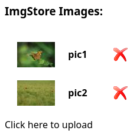

# ImgFS

ImgFS is an image-oriented file system with command-line interface (CLI) tools and a multithreaded web server for managing and serving images.

## Prerequisites Installation

```bash
sudo apt install check pip pkg-config libvips-dev libjson-c-dev
pip install parse robotframework
```

## Compiling
To compile the project, run the following command inside the `done` directory:

```bash
make all
```

## Running the CLI Tools
The `imgfscmd` executable provides various commands to manage imgFS files. Use the following syntax:
```bash
> ./imgfscmd help
imgfscmd [COMMAND] [ARGUMENTS]
  help: displays this help.
  list <imgFS_filename>: list imgFS content.
  create <imgFS_filename> [options]: create a new imgFS.
      options are:
          -max_files <MAX_FILES>: maximum number of files.
                                  default value is 128
                                  maximum value is 4294967295
          -thumb_res <X_RES> <Y_RES>: resolution for thumbnail images.
                                  default value is 64x64
                                  maximum value is 128x128
          -small_res <X_RES> <Y_RES>: resolution for small images.
                                  default value is 256x256
                                  maximum value is 512x512
  read   <imgFS_filename> <imgID> [original|orig|thumbnail|thumb|small]:
      read an image from the imgFS and save it to a file.
      default resolution is "original".
  insert <imgFS_filename> <imgID> <filename>: insert a new image in the imgFS.
  delete <imgFS_filename> <imgID>: delete image imgID from imgFS.
```

## Multithreaded Web Server

To run the multithreaded web server:

```bash
cp ../provided/src/index.html .
imgfs_server <ImgFS file> <port number>
```
